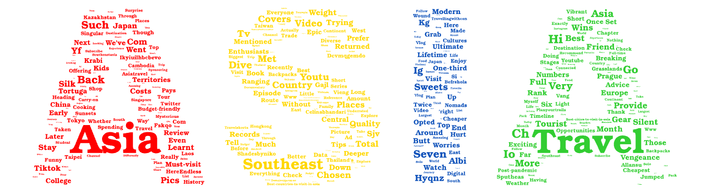
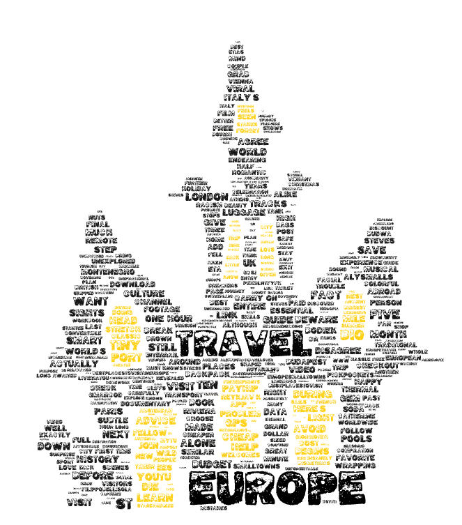

# World in word Clouds
## Project Overview
This project explores how travel related interests vary across different world regions by analyzing YouTube search results for continent specific search terms. To achieve this, we use web scraping.

The main objective of this project is to identify patterns in the types of travel content that are most visible and popular for different regions and what travellers would likely be able to stumble upon inputting differnt search queries during their next travel. This project will identify travel themes, and destinations by analysing the descriptions from multiple videos that appear during each key word search. 

## Methodology
This study collects data from YouTube search result pages to analyze travel related content across different world regions. Six search queries were defined to represent continental travel interests: "Travel Africa", "Travel South America", "Travel North America", "Travel Australia", "Travel Asia", and "Travel Europe". 

For each search term, an automated web scrapping script was executed using Selenium controlled browser and the BeautifulSoup HTML parser. The script loaded the youtube search results page for each query and simulated user scrolling behaviour to load additional videos dynamically. Each page was scrolled 5 times with a 5 second rest in between each scroll to gather newly loaded content. 

> For each gathered video, the following features were extracted: 
- Video URL
- User URL
- Channel name
- Video title
- Number of views
- Time since video uploaded
- Short description
- Data collection timestamp
- Search term (continents)

For every search term, the extracted video metadata was stored in a pandas dataframe. Each dataset was exported as a separate CSV file named based off the search term (eg, travel_africa.csv, travel_europe.csv).

## Datasets Used

- Africa: 
- Asia: 
- Australia: 
- Europe: 
- North America: 
- South America: 

## Purpose of Anaysis
The purpose of this project is to analyse travel related youtube search results to understand how travel interests and contents differ across continents. By identifying key patterns through word cloud analyis from video descriptions, this project aims to find out patterns in popular destinations across the identified continents' travel content. The project aims to answer the following questions: 
> - What types of travel themes and destinations mostly appear in YouTube search results for each continent?
> - How do descriptive patterns differ across regions interms of destinations, activities, hitory, and cultural references?
> - Are certain types of travel expireinces more heavily emphasized in some continents than others?

## Results: Word cloud Analysis

### Africa

The Africa word cloud is dominated by words such as Safari, Nature, Explore, wonders, and country names such as Tanzania, Ethiopia, South Africa, and Kenya, suggests that there is a stong travel content based on nature tourism and wildlife expiriences. This indicates that travel content related to Africa is usually surrounds adventure, and nature activities. 

### Asia

The Asia word cloud is dominated by regional and travel related terms such as Asia, Travel, Southeast, and Destination. This indicaets that much of the content is framed around general travel guides rather than single country narratives. The dominance of geographic references such as Japan, Thailand, Vietnam, Cambodia, China, and major cities like Tokyo, Taipei, Singapore, and Hong Kong points that there is a stong focus on the eastern Asia and Southeast Asia as a primary travel destinations. Along with that, keyterms such as backpacks, solo, budget, cheap, and itinerary put an emphasis on backpacking, solo travel, and budget friendly expiriences. In addition to that, the common appearance of terms related to food and culture, such as Food, street, ancient, temples, and Cultures, show that Asian travel content usualy centers on food exploration as an expirience and historic and cultural attractions.

### Australia

In The Australia word cloud Major cities and landmarks, including Sydney, Melbourne, Harbour, Opera House, Bridge, and Uluru, appear frequently, which suggest a strong emphasis on iconic urban destinations. Natural attractions are also very much represented through keywords such as Beach, Reef, Outback, Rainforest, Wildlife, and Landscapes, which reflect Australia's strong nature based and outdoor expirience tourism branding. There is also a high presence of planning related terms such as Tips, Advice, Planning, and Week, and these terms indicate that many videos are designed to help viewers organize their trips. 

### Eurpoe

The Europe word cloud is dominated by guide based language like Austrialia, with frequent terms such as Europe, travel, visit, places, best, and trip. There is also a strong presence of cultural and historical keywords such as History, Historic, Culture, Landmarks, Ancient, Midieval, and references to major cities such as Paris, Rome, London, Vienna, Amsterdam, Budapest, and Athens. This shows Europe is branded as a travel destination rich in historical heritage, architecture, and cultural tourism. The appearance of transportation related terms such as Train, Interrail, and Ticket suggest that there is a strong interrail system between countries. 

In addition to that, the word cloud contains safety related and budgeting terms such as Budget, Cheap, Affordable, Money, Save, Pickpockets, and Beware, which indicate that contents advice travelers how to expirience Europe on budget while also being cautious during their Europe travel.

### North America

The North America word cloud puts a strong emphasis on natural landscapes and scenic travel through keywords such as Nature, Beauty, Scenic, Forests, Wilderness, Redwood, Deserts, Niagara Falls, Alaska, Coast, and Islands. This shows that North American travel content usually shows national parks, road trips, and outdoor experiences as main attractions. The presence of transportation related terms such as Road, Roadtrips, Trains, Cruise, and Highway further reinforces the importance of long distance and scenic travel within the region.

In addition, the word cloud includes a mix of major cities and destinations such as Seattle, Vancouver, Toronto, Quebec, California, Hawaii, Mexico, Bahamas, and Jamaica, suggesting that content frequently aggregates urban tourism with nature based and coastal travel. 

### South America

The South American Word Cloud has a strong presence of Backpack, Month, Week, Full-time, and Itinerary reflects a focus on extended travel, backpacking, and long duration journeys, which are common narratives in South American travel content. Natural landscapes and outdoor adventure are central themes in the word cloud, as shown by repeated terms such as Patagonia, Amazon, Andes, Mountains, Landscapes, Jungle, Rainforest, Glacial, and Lakes. These keywords indicate that South America is frequently imagined as a destination for adventure tourism and nature based exploration, in addition, cultural and historical references such as Ancient, Civilizations, Ruins, Machu Picchu, Cusco, and Sacred Valley suggest a strong emphasis on archaeological heritage and Indigenous history within travel narratives.

## Future Improvements

Although my study provides an overview of how travel content is found across continents using word cloud anaysis, one improvement I see that would strengthn future research is integrating metadata such as view counts, likes, upload dates, or channel categories to anayize how popularity of the creator, release date, and view counts influence the language used in the travel content. And also comparing trends over time could also show how travel narratives shift in response to tourism trends. 

## Unexpected Findings

One surprising observation is the strong emphasis on branding terms, particularly in Asia and Europe. Words such as “subscribe,” “channel,” “Instagram,” “link,” “app,” and references to sponsorships appear frequently. This highlights how travel content is not only about destinations but is also closely tied to influencer marketing and monetization strategies, which I did not anticipate to be so visible in the descriptive text at all. 

